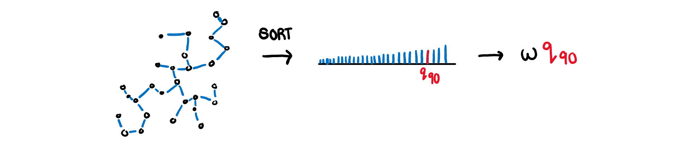
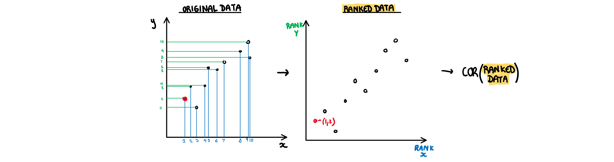

```{r setup, include=FALSE}
knitr::opts_chunk$set(echo = FALSE, warning = FALSE, message = FALSE, eval=FALSE)
library(plotly)
library(ggplot2)
```

# Introduction
## Objective
Visualising high dimensional data is often difficult and requires a trade-off between the usefulness of the plots and maintaining the structures of the original data. Scagnostics (scatterplot diagnostics) are a set of visual features that can be used to identify interesting and abnormal scatterplots, and thus give a sense of priority to the variables we choose to visualise. This proposal will discuss the creation of an R package that will provide a user-friendly method to calculate these scagnostics. The package will be tested on datasets with known interesting visual features to ensure the scagnostics are working as expected, before finally being used to explore and describe a time series dataset.

## Background and Motivation
As the number of dimensions in a dataset increases, the process of visualising its structure and variable dependencies becomes more tedious. This is because the number of possible pairwise plots rises exponentially with the number of dimensions. Datasets like Anscombe's quartet [@anscombe] or the datasaurus dozen [@datasaurpkg] have been constructed such that each pairwise plot has the same summary statistics but strikingly different visual features. This design is to illustrate the pitfalls of numerical summaries and the importance of visualisation. This means that despite the issues that come with increasing dimensionality, visualisation of the data cannot be ignored. Scagnostics offer one possible solution to this issue.

The term scagnostics was introduced by John Tukey in 1982 [@tukey]. Tukey discusses the value of a cognostic (a diagnostic that should be interpreted by a computer rather than a human) to filter out uninteresting visualisations. He denotes a cognostic that is specific to scatter plots a scagnostic. Up to a moderate number of variables, a scatter plot matrix (SPLOM) can be used to create pairwise visualisations, however, this solution quickly becomes infeasible. Thus, instead of trying to view every possible variable combination, the workload is reduced by calculating a series of visual features, and only presenting the outlier scatter plots on these feature combinations. 

There is a large amount of research into visualising high dimensional data, most of which focuses on some form of dimension reduction. This can be done by creating a hierarchy of potential variables, performing a transformation of the variables, or some combination of the two. Unfortunately none of these methods are without pitfalls. Linear transformations are subject to crowding, where low level projections concentrate data in the centre of the distribution, making it difficult to differentiate data points [@crowding]. Non-linear transformations often have complex parameterisations, and can break the underlying global structure of the data, creating misleading visualisations. While there are solutions within these methods to fix these issues such as a burning sage tour for crowding [@burningsage] or liminal package for maintaining global structure [@liminal] all these methods still involve some transformation of the data. Scagnostics gives the benefit of allowing the user to view relationships between the variables in their raw form. This means they are not subject to the linear transformation issue of crowding, or the non-linear transformation issue of misleading global structures. That being said, only viewing pairwise plots can leave our variable interpretations without context.  Methods such as those shown in *ScagExplorer* [@scagexplorer] try to address this by visualising the pairwise plots in relation to the scagnostic measures distribution, but ultimately the lack of context remains one of the limitations of using scagnostics alone as a dimension reduction technique.

Scagnostics are not only useful in isolation, they can be applied in conjunction with other techniques to find interesting feature combinations of the transformed variables. The tourr projection pursuit currently uses a selection of scagnostics to identify interesting low level projections and move the visualisation towards them [@tourrpp]. Since scagnostics are not dependent on the type of data, they can also be used to compare and contrast scatter plots regardless of the discipline. In this way, they are a useful metric for something like the comparisons described in *A self-organizing, living library of time-series data*, which tries to organise time series by their features instead of on their metadata [@sots]. 

Several scagnostics have been previously defined in *Graph-Theoretic Scagnostics* [@scag], which are typically considered the basis of the visual features. They were all constructed to range [0,1], and later scagnostics have maintained this scale. The formula for these measures were revised in *Scagnostic Distributions* and are still calculated according to this paper [@scagdist]. In addition to the main nine, the benefit of using two additional association scagnostics were discussed in Katrin Grimm's PhD thesis [@Grimm]. These two association measures are also used in the tourr projection pursuit [@tourrpp]. These are the primary scagnostics that are being implemented in the R package and will be described in the methods section.

## Contribution
The purpose of this research project is to create a user friendly R package that computes the previously established scagnostics and also introduce some new measures for features that are currently overlooked. There are two previously established scagnostics packages, the live package *scagnostics* [@scagdist] and the archived package *binostics* [@binostics]. Both are based on the original C++ code from the *Scagnostic Distributions* paper, which is difficult to read and therefore difficult to debug. Writing a new scagnostics package in R will allow for these techniques to be understood and extended upon, which is currently not possible with the C++ code.   

# Scagnostic Definitions
## Underlying Definitions
In order to capture the visual structure of the data, graph theory is used to calculate most of the scagnostics. The pairwise scatter plot is re-constructed as a graph with the data points as vertices and the edges are calculated using Delaunay triangulation. In the package this calculation is done using the alphahull package [@alphahull] to construct an object called a scree. This is the basis for all the other objects that are used to calculate the scagnostics (except for monotonic, dcor and splines which use the raw data). The graph (screen object) is then used to construct the three key structures on which the scagnostics are based; the convex hull, alpha hull and minimum-spanning tree (MST).

- **Convex hull:** The outside vertices of the graph, connected to make a convex polygon that contains all points. It is constructed usnig the tripack package.

- **Alpha hull:** A collection of boundaries that contain all the points in the graph. Unlike the convex hull, it does not need to be convex. It is calculated using the alphahull package [@alphahull].

- **MST:** the minimum spanning tree, i.e the smallest distance of branches that can be used to connect all the points. In the package it is calculated from the graph using the igraph package [@igraph].  


## Measure Defintions
The nine scagnostics defined in *Scagnostic Distributions* are detailed below with an explanation, formula, and visualisation.  We will let *A*= alpha Hull *C*= convex hull, *M* = minimum spanning tree, and *s*= the scagnostic measure. Since some of the measures have some sample size dependence, we will let *w* be a constant that adjusts for that.  

- **Convex:** Measure of how convex the shape of the data is. Computed as the ratio between the area of the alpha hull (A) and convex hull (C).  
  
$$s_{convex}=w\frac{area(A)}{area(C)}$$  

  


- **Skinny:** A measure of how "thin" the shape of the data is. It is calculated as the ratio between the area and perimeter of the alpha hull (A) with some normalisation such that 0 correspond to a perfect circle and values close to 1 indicate a skinny polygon.  

$$s_{skinny}= 1-\frac{\sqrt{4\pi area(A)}}{perimeter(A)}$$  


- **Outlying:** A measure of proportion and severity of outliers in dataset. Calculated by comparing the edge lengths of the outlying points in the MST with the length of the entire MST.  

$$s_{outlying}=\frac{length(M_{outliers})}{length(M)}$$  

  


- **Stringy:** This measure identifies a "stringy" shape with no branches, such as a thin line of data. It is calculated by comparing the number of vertices of degree two ($V^{(2)}$) with the total number of vertices ($V$), dropping those of degree one ($V^{(1)}$).  

$$s_{stringy} = \frac{|V^{(2)}|}{|V|-|V^{(1)}|}$$  

 


- **Skewed:** A measure of skewness in the edge lengths of the MST (not in the distribution of the data). It is calculated as the ratio between the 40% IQR and the 80% IQR, adjusted for sample size dependence.  

$$s_{skewed} = 1-w(1-\frac{q_{90}-{q_{50}}}{q_{90}-q_{10}})$$  

  


- **Sparse:**  Identifies if the data is sporadically located on the plane. Calculated as the 90th percentile of MST edge lengths.

$$s_{sparse}= wq_{90}$$




- **Clumpy:** This measure is used to detect clustering and is calculated through an iterative process. First an edge J is selected and removed from the MST. From the two spanning trees that are created by this break, we select the largest edge from the smaller tree (K). The length of this edge (K) is compared to the removed edge (J) giving a clumpy measure for this edge. This process is repeated for every edge in the MST and the final clumpy measure is the maximum of this value over all edges.  

$$\max_{j}[1-\frac{\max_{k}[length(e_k)]}{length(e_j)}]$$  
 


- **Striated:** This measure identifies features such as discreteness by finding parallel lines, or smooth algebraic functions. Calculated by counting the proportion of acute (0 to 40 degree) angles between the adjacent edges of vertices with only two edges.  

$$\frac1{|V|}\sum_{v \in V^{2}}I(cos\theta_{e(v,a)e(v,b)}<-0.75)$$  
 

  
- **Monotonic:** Checks if the data has an increasing or decreasing trend. Calculated as the Spearman correlation coefficient, i.e. the Pearson correlation between the ranks of x and y.  

$$s_{monotonic} = r^2_{spearman}$$
  


The two additional scagnostics discussed by Katrin Grimm are described below.


- **Splines:** Measures the functional non-linear dependence by fitting a penalised splines model on X using Y, and on Y using X. The variance of the residuals are scaled down by the axis so they are comparable, and finally the maximum is taken. Therefore the value will be closer to 1 if either relationship can be decently explained by a splines model.

$$s_{splines}=\max_{i\in x,y}[1-\frac{Var(Residuals_{model~i=.})}{Var(i)}]$$

 


- **Dcor:** A measure of non-linear dependence which is 0 if and only if the two variables are independent. Computed using an ANOVA like calculation on the pairwise distances between observations. 

$$s_{dcor}= \sqrt{\frac{\mathcal{V}(X,Y)}{\mathcal{V}(X,X)\mathcal{V}(Y,Y)}}$$  
where
$$\mathcal{V}
(X,Y)=\frac{1}{n^2}\sum_{k=1}^n\sum_{l=1}^nA_{kl}B_{kl}$$  
where
$$A_{kl}=a_{kl}-\bar{a}_{k.}-\bar{a}_{.j}-\bar{a}_{..}$$
$$B_{kl}=b_{kl}-\bar{b}_{k.}-\bar{b}_{.j}-\bar{b}_{..}$$


# Example 
## Scagnostic Assessment
At present, all 11 scagnostics have, at a minimum, a draft version of their code. In their current state, they may not follow the most efficient method, but they work and calculate the measures according to their definition. This has introduced two new problems for the package.

The first issue is that some of the scagnostics do not scale when calculated on large datasets. When the scagnostics were originally designed, they were calculated on binned data, that is, all the points within a certain area were pooled together. For the package we want this to remain optional. Unfortunately it turns out that a lot of the scagnsotics, with their current definitions do not work on data that has not been pooled. If we take a look at the scagnsotics computed on the datasaurus dozen dataset (which is loaded with the package to provide example code) several of the measures return values that, by the intuitive interpretation of their definition, should be incorrect.

```{r, Example Code, include=FALSE, echo=FALSE, message=FALSE, cache=TRUE}
#pick examples
exampledata <- datasaurus_dozen %>%
  filter(dataset %in% c("v_lines", "circle", "star", "away")) 

#plot them
plot1 <- exampledata %>%
  ggplot(aes(x=x,y=y, colour=dataset))+
  geom_point() +
  facet_wrap("dataset") +
  theme_minimal()+
  theme(aspect.ratio = 1, legend.position="none")
```

```{r, Example Figures, echo=FALSE, warning=FALSE, fig.align='center', fig.height=4, fig.width=6}
plot1
read.csv("m4table.csv")[-1] %>%
  knitr::kable(digits=4, align="c")
```

To give just a few examples of how the measures are misbehaving, we can look at the skewed, sparse and clumpy measures. Without binning the skewed and sparse measures never rise above 0.1 and the larger the data set, the lower the metric is. Removing binning makes these measures dependent on the size of the dataset and so they need some kind of data size adjustment. Clumpy has high scores on circle start and v_lines which would not be considered clumpy scatter plots if inspected visually. This measure seems to either have an error in its code (it worked according to the definition on the scatter plots it was tested on) or it does not always follow the human interpretation of clumpy.

Almost all the scagnostics built using the scree object have some strange result similar to the examples above, either because the binning step has been skipped, or the measure itself is not consistent. For this reason, the original 11 scagnostics will need more testing and work to make sure they are actually measuring what their definition implies they are.  

## Analysis of Different Types of Time Series


```{Get Data}
# install.packages("devtools")
#devtools::install_github("robjhyndman/compenginets")
library(compenginets)
library(tsfeatures)
library(tidyverse)
library(vaast)

#get 3 different timeseries
cets_birdsong <- get_cets("Birdsong")
cets_finance <- get_cets("Finance")
cets_music <- get_cets("Music")

#idk what this does but im checking it
feat_birdsongs <- tsfeatures(cets_birdsong) %>%
  mutate(type="birdsongs")
feat_finance <- tsfeatures(cets_finance)%>%
  mutate(type="finance")
feat_music <- tsfeatures(cets_music)%>%
  mutate(type="music")

#make timeseries plot

#make big dataset
features_bfm <- bind_rows(feat_birdsongs,feat_finance,feat_music)

#scatterplot
features_bfm %>%
  GGally::ggpairs(columns = 8:16,ggplot2::aes(colour=type))


#calcualte scagnsotics
features_bfm %>%
  group_by(type) %>%
  summarise(monotonic=sc_monotonic(e_acf10,x_acf1), 
            dcor=sc_dcor(e_acf10,x_acf1), 
            splines=sc_splines(e_acf10,x_acf1),
            skinny = sc_skinny(e_acf10,x_acf1),
            convex = sc_convex(e_acf10,x_acf1),
            striated = sc_striated(e_acf10,x_acf1),
            stringy = sc_stringy(e_acf10,x_acf1),
            ) %>%
  knitr::kable(digits=4, align="c")

#
ggplot(features_bfm, aes(x=e_acf10,y=x_acf1, colour=type))+
  geom_point()+
  facet_wrap(~type,scales="free")+
  theme(aspect.ratio=1)

features_bfm %>%
  group_by(type) %>%
  summarise(monotonic=sc_monotonic(entropy,x_acf10), 
            dcor=sc_dcor(entropy,x_acf10), 
            splines=sc_splines(entropy,x_acf10),
            skinny = sc_skinny(entropy,x_acf10),
            convex = sc_convex(entropy,x_acf10),
            striated = sc_striated(entropy,x_acf10),
            stringy = sc_stringy(entropy,x_acf10),
            ) %>%
  knitr::kable(digits=4, align="c")

#
ggplot(features_bfm, aes(x=entropy,y=x_acf10, colour=type))+
  geom_point()+
  facet_wrap(~type,scales="free")+
  theme(aspect.ratio=1)

features_bfm %>%
  group_by(type) %>%
  summarise(monotonic=sc_monotonic(entropy,diff1_acf1), 
            dcor=sc_dcor(entropy,diff1_acf1), 
            splines=sc_splines(entropy,diff1_acf1),
            skinny = sc_skinny(entropy,diff1_acf1),
            convex = sc_convex(entropy,diff1_acf1),
            striated = sc_striated(entropy,diff1_acf1),
            stringy = sc_stringy(entropy,diff1_acf1),
            ) %>%
  knitr::kable(digits=4, align="c")

#
ggplot(features_bfm, aes(x=entropy,y=diff1_acf1, colour=type))+
  geom_point()+
  facet_wrap(~type,scales="free")+
  theme(aspect.ratio=1)

features_bfm %>%
  group_by(type) %>%
  summarise(monotonic=sc_monotonic(x_acf1,diff2_acf1), 
            dcor=sc_dcor(x_acf1,diff2_acf1), 
            splines=sc_splines(x_acf1,diff2_acf1),
            skinny = sc_skinny(x_acf1,diff2_acf1),
            convex = sc_convex(x_acf1,diff2_acf1),
            striated = sc_striated(x_acf1,diff2_acf1),
            stringy = sc_stringy(x_acf1,diff2_acf1),
            ) %>%
  knitr::kable(digits=4, align="c")

#
ggplot(features_bfm, aes(x=x_acf1,y=diff2_acf1, colour=type))+
  geom_point()+
  facet_wrap(~type,scales="free")+
  theme(aspect.ratio=1)
```

# Appendix

```{r setup2, include=FALSE}
knitr::opts_chunk$set(echo = TRUE, eval=FALSE)
```


# References
```{r, include=FALSE, eval=FALSE}
library(spelling)
rmd <- "research_proposal.rmd"
ignore <- readLines("WORDLIST")
check_spelling <- spell_check_files(
  rmd,
  ignore = ignore,
  lang = "en_GB"
)
if (nrow(check_spelling) > 0) {
  print(check_spelling)
  stop("Check spelling in Rmd files!")
}
```