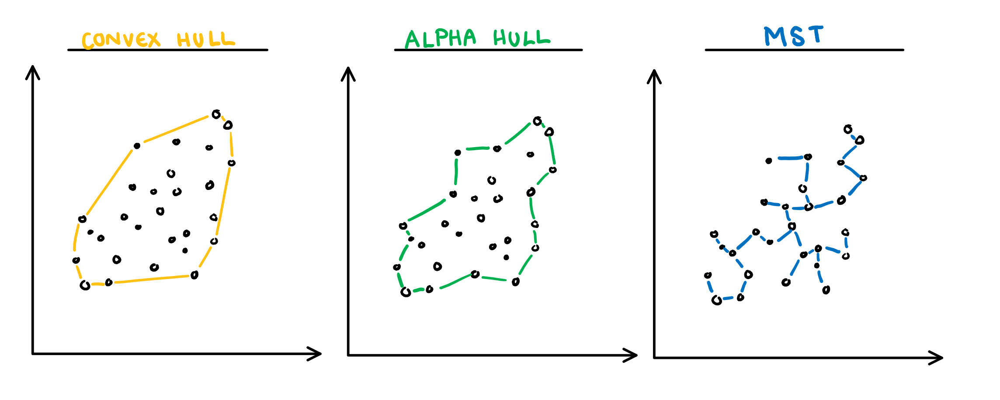
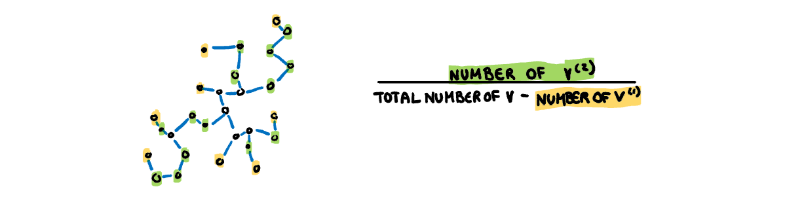
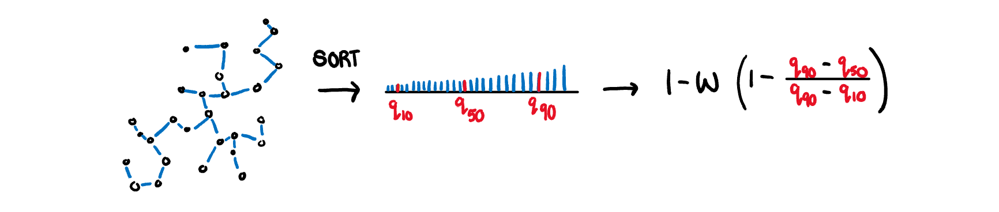
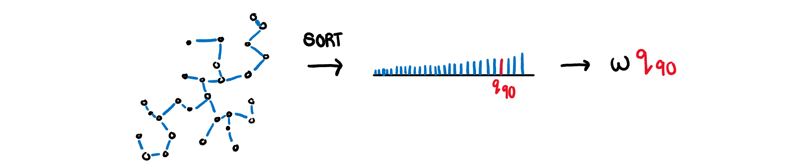
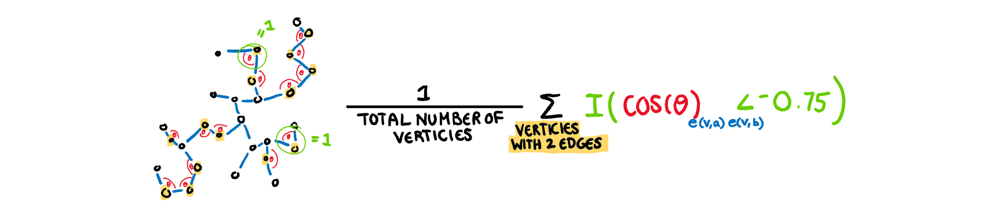
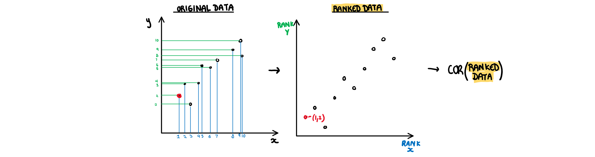

```{r setup, include=FALSE}
knitr::opts_chunk$set(
  echo = FALSE, 
  warning = FALSE, 
  message = FALSE)
```

```{r load-libraries}
library(cassowaryr)
library(GGally)
library(plotly)
library(tidyverse)
library(plotly)
library(patchwork)
library(knitr)
library(ggimg) #for the visual table
library(ggstance) #for vertical dodge on plot
library(fitzRoy) #for AFLW data
library(gridExtra) #groups of static scatter plots
```

# Introduction

Visualising high dimensional data is often difficult and requires a trade-off between the usefulness of the plots and maintaining the structures of the original data. This is because the number of possible pairwise plots rises exponentially with the number of dimensions. Datasets like Anscombe's quartet [@anscombe] or the datasaurus dozen [@datasaurpkg] have been constructed such that each pairwise plot has the same summary statistics but strikingly different visual features. This design is to illustrate the pitfalls of numerical summaries and the importance of visualisation. This means that despite the issues that come with increasing dimensionality, visualisation of the data cannot be ignored. Scagnostics offer one possible solution to this issue.

The term scagnostics was introduced by John Tukey in 1982 [@tukey]. Tukey discusses the value of a cognostic (a diagnostic that should be interpreted by a computer rather than a human) to filter out uninteresting visualisations. He denotes a cognostic that is specific to scatter plots a scagnostic. Up to a moderate number of variables, a scatter plot matrix (SPLOM) can be used to create pairwise visualisations, however, this solution quickly becomes infeasible. Thus, instead of trying to view every possible variable combination, the workload is reduced by calculating a series of visual features, and only presenting the outlier scatter plots on these feature combinations. 

There is a large amount of research into visualising high dimensional data, most of which focuses on some form of dimension reduction. This can be done by creating a hierarchy of potential variables, performing a transformation of the variables, or some combination of the two. Unfortunately none of these methods are without pitfalls. Linear transformations are subject to crowding, where low level projections concentrate data in the centre of the distribution, making it difficult to differentiate data points [@crowding]. Non-linear transformations often have complex parameterisations, and can break the underlying global structure of the data, creating misleading visualisations. While there are solutions within these methods to fix these issues such as a burning sage tour which zooms in further on points closer to the middle of a tour to prevent crowding [@burningsage], or the liminal package which facilitates linked brushing between a non-linear and linear data transformations to maintaining global structure [@liminal], all these methods still involve some transformation of the data. Scagnostics gives the benefit of allowing the user to view relationships between the variables in their raw form. This means they are not subject to the linear transformation issue of crowding, or the non-linear transformation issue of misleading global structures. That being said, only viewing pairwise plots can leave our variable interpretations without context.  Methods such as those shown in *ScagExplorer* [@scagexplorer] try to address this by visualising the pairwise plots in relation to the scagnostic measures distribution, but ultimately the lack of context remains one of the limitations of using scagnostics alone as a dimension reduction technique.

Scagnostics are not only useful in isolation, they can be applied in conjunction with other techniques to find interesting feature combinations of the transformed variables. The tourr projection pursuit currently uses a selection of scagnostics to identify interesting low level projections and move the visualisation towards them [@tourrpp]. Since scagnostics are not dependent on the type of data, they can also be used to compare and contrast scatter plots regardless of the discipline. In this way, they are a useful metric for something like the comparisons described in *A self-organizing, living library of time-series data*, which tries to organise time series by their features instead of on their metadata [@sots]. 

Several scagnostics have been previously defined in *Graph-Theoretic Scagnostics* [@scag], which are typically considered the basis of the visual features. They were all constructed to range [0,1], and later scagnostics have maintained this scale. The formula for these measures were revised in *Scagnostic Distributions* and are still calculated according to this paper [@scagdist]. In addition to the main nine, the benefit of using two additional association scagnostics were discussed in Katrin Grimm's PhD thesis [@Grimm]. These two association measures are also used in the tourr projection pursuit [@tourrpp]. 

There are two existing scagnostics packages, *scagnostics* [@scagdist] and the archived package *binostics* [@binostics]. Both are based on the original C++ code from *Scagnostic Distributions* [@scagdist], which is difficult to read and difficult to debug. Thus there is a need for a new implementation that enables better diagnosis of the scagnostics, and better graphical tools for examining the results. 

This paper describes the R package, `cassowaryr` that computes the currently existing scagnostics, and adds several new measures.  The paper is organised as follows. The next section explains the scagnostics. This is followed by a description of the implementation. Several examples using collections of time series and XXX illustrate the usage. 

# Scagnostics

## Building blocks for the graph-based metrics

In order to capture the visual structure of the data, graph theory is used to calculate most of the scagnostics. The pairwise scatter plot is re-constructed as a graph with the data points as vertices and the edges are calculated using Delaunay triangulation. In the package, this calculation is done using the alphahull package [@alphahull] to construct an object called a `scree`. This is the basis for all the other objects that are used to calculate the scagnostics (except for monotonic, dcor and splines which use the raw data). The graph (screen object) is then used to construct the three key structures on which the scagnostics are based; the convex hull, alpha hull and minimum-spanning tree (MST) (Figure \@ref(fig:building-blocks2)).

- **Convex hull:** The outside vertices of the graph, connected to make a convex polygon that contains all points. It is constructed usnig the tripack package.

- **Alpha hull:** A collection of boundaries that contain all the points in the graph. Unlike the convex hull, it does not need to be convex. It is calculated using the alphahull package [@alphahull].

- **MST:** the minimum spanning tree, i.e the smallest distance of branches that can be used to connect all the points. In the package it is calculated from the graph using the igraph package [@igraph].  

```{r building-blocks, out.height = "30%", out.width = "100%", fig.cap = "The building blocks for graph-based scagnostics", eval=FALSE}

```

```{r building-blocks2, width = 15, height = 5, out.width = "100%", fig.cap = "The building blocks for graph-based scagnostics"}
library(alphahull)
data("features")
nl <- features %>% filter(feature == "nonlinear2")
d1 <- draw_convexhull(nl$x, nl$y, clr="#FFD700", fill=TRUE) +
  ggtitle("a. Convex hull") +
  xlab("") + ylab("") +
  theme_void() +
  theme(aspect.ratio=1, axis.text = element_blank())
d2 <- draw_alphahull(nl$x, nl$y, clr="#00a800") +
  ggtitle("b. Alpha hull") +
  xlab("") + ylab("") +
  theme_void() +
  theme(aspect.ratio=1, axis.text = element_blank())
d3 <- draw_mst(nl$x, nl$y) +
  ggtitle("c. Min. span. tree") +
  xlab("") + ylab("") +
  theme_void() +
  theme(aspect.ratio=1, axis.text = element_blank())
d1 + d2 + d3
```

## Graph-based scagnostics

The nine scagnostics defined in *Scagnostic Distributions* are detailed below with an explanation, formula, and visualisation.  We will let *A*= alpha Hull *C*= convex hull, *M* = minimum spanning tree, and *s*= the scagnostic measure. Since some of the measures have some sample size dependence, we will let *w* be a constant that adjusts for that.  

- **Convex:** Measure of how convex the shape of the data is. Computed as the ratio between the area of the alpha hull (A) and convex hull (C).  

$$s_{convex}=w\frac{area(A)}{area(C)}$$  
```{r convexscag, out.height = "20%", out.width = "100%", fig.cap = "Convex Scagnostic Visual Explanation"}

```


- **Skinny:** A measure of how "thin" the shape of the data is. It is calculated as the ratio between the area and perimeter of the alpha hull (A) with some normalisation such that 0 correspond to a perfect circle and values close to 1 indicate a skinny polygon.  

$$s_{skinny}= 1-\frac{\sqrt{4\pi area(A)}}{perimeter(A)}$$  

```{r skinnyscag, out.height = "20%", out.width = "100%", fig.cap = "Skinny Scagnostic Visual Explanation"}

```

- **Outlying:** A measure of proportion and severity of outliers in dataset. Calculated by comparing the edge lengths of the outlying points in the MST with the length of the entire MST.  

$$s_{outlying}=\frac{length(M_{outliers})}{length(M)}$$  

```{r outlyingscag, out.height = "20%", out.width = "100%", fig.cap = "Outlying Scagnostic Visual Explanation"}
knitr::include_graphics("figures/drawoutlying.png")
```

- **Stringy:** This measure identifies a "stringy" shape with no branches, such as a thin line of data. It is calculated by comparing the number of vertices of degree two ($V^{(2)}$) with the total number of vertices ($V$), dropping those of degree one ($V^{(1)}$).  

$$s_{stringy} = \frac{|V^{(2)}|}{|V|-|V^{(1)}|}$$  

```{r stringyscag, out.height = "20%", out.width = "100%", fig.cap = "Stringy Scagnostic Visual Explanation"}

```

- **Skewed:** A measure of skewness in the edge lengths of the MST (not in the distribution of the data). It is calculated as the ratio between the 40% IQR and the 80% IQR, adjusted for sample size dependence.  

$$s_{skewed} = 1-w(1-\frac{q_{90}-{q_{50}}}{q_{90}-q_{10}})$$  

```{r skewedscag, out.height = "20%", out.width = "100%", fig.cap = "Skewed Scagnostic Visual Explanation"}

```

- **Sparse:**  Identifies if the data is sporadically located on the plane. Calculated as the 90th percentile of MST edge lengths.

$$s_{sparse}= wq_{90}$$

```{r sparsescag, out.height = "20%", out.width = "100%", fig.cap = "Sparse Scagnostic Visual Explanation"}

```


- **Clumpy:** This measure is used to detect clustering and is calculated through an iterative process. First an edge J is selected and removed from the MST. From the two spanning trees that are created by this break, we select the largest edge from the smaller tree (K). The length of this edge (K) is compared to the removed edge (J) giving a clumpy measure for this edge. This process is repeated for every edge in the MST and the final clumpy measure is the maximum of this value over all edges.  

$$\max_{j}[1-\frac{\max_{k}[length(e_k)]}{length(e_j)}]$$  

```{r clumpyscag, out.height = "20%", out.width = "100%", fig.cap = "Clumpy Scagnostic Visual Explanation"}
knitr::include_graphics("figures/drawclumpy.png")
```


- **Striated:** This measure identifies features such as discreteness by finding parallel lines, or smooth algebraic functions. Calculated by counting the proportion of acute (0 to 40 degree) angles between the adjacent edges of vertices with only two edges.  

$$\frac1{|V|}\sum_{v \in V^{2}}I(cos\theta_{e(v,a)e(v,b)}<-0.75)$$  

```{r striatedscag, out.height = "20%", out.width = "100%", fig.cap = "Striated Scagnostic Visual Explanation"}

```


## Association-based scagnostics 

 
- **Monotonic:** Checks if the data has an increasing or decreasing trend. Calculated as the Spearman correlation coefficient, i.e. the Pearson correlation between the ranks of x and y.  

$$s_{monotonic} = r^2_{spearman}$$

```{r monotonicscag, out.height = "20%", out.width = "100%", fig.cap = "Monotonic Scagnostic Visual Explanation"}

```
  

The two additional scagnostics discussed by Katrin Grimm are described below.

- **Splines:** Measures the functional non-linear dependence by fitting a penalised splines model on X using Y, and on Y using X. The variance of the residuals are scaled down by the axis so they are comparable, and finally the maximum is taken. Therefore the value will be closer to 1 if either relationship can be decently explained by a splines model.

$$s_{splines}=\max_{i\in x,y}[1-\frac{Var(Residuals_{model~i=.})}{Var(i)}]$$
```{r splinescag, out.height = "20%", out.width = "100%", fig.cap = "Splines Scagnostic Visual Explanation"}
knitr::include_graphics("figures/drawsplines.png")
```


- **Dcor:** A measure of non-linear dependence which is 0 if and only if the two variables are independent. Computed using an ANOVA like calculation on the pairwise distances between observations. 

$$s_{dcor}= \sqrt{\frac{\mathcal{V}(X,Y)}{\mathcal{V}(X,X)\mathcal{V}(Y,Y)}}$$  
where
$$\mathcal{V}
(X,Y)=\frac{1}{n^2}\sum_{k=1}^n\sum_{l=1}^nA_{kl}B_{kl}$$  
where
$$A_{kl}=a_{kl}-\bar{a}_{k.}-\bar{a}_{.j}-\bar{a}_{..}$$
$$B_{kl}=b_{kl}-\bar{b}_{k.}-\bar{b}_{.j}-\bar{b}_{..}$$

```{r dcorscag, out.height = "20%", out.width = "100%", fig.cap = "Dcor Scagnostic Visual Explanation"}
knitr::include_graphics("figures/drawdcor.png")
```


## Checking the scagnostics calculations 
Once we have working functions that correctly calculate the scagnostics according to their definition, we can assess how well they identify the visual features of scatter plots. To test the packages ability to differentiate plots, we have creates a dataset called "features" (that is also in the Cassowaryr package) that contains a series of interesting and unique scatter plots which we can run our scagnsotics on.

```{r, Features plot, width = 150, height = 150, out.width = "100%", fig.cap = "The Scatter Plots of the Features Dataset"}
mypal <- c("#b2182b", "#d53e4f","#FF4E50", "#FC913A", "#fdae61",
           "#F9D423", "#fee08b" , "#abdda4" , "#a6d96a" , "#66c2a5" ,
           "#66bd63","#3B8183", "#3288bd", "#74add1",  "#abd9e9")

#plot them
ggplot(features, aes(x,y,colour=feature))+
  geom_point() +
  theme_minimal() + 
  facet_wrap(~feature, ncol=5, scales="free") +
  xlab("") + ylab("") +
  theme(legend.position = "none", 
        aspect.ratio= 1, 
        axis.text = element_blank()) +
  scale_colour_manual(values = mypal)

```

These scatter plots typify certain visual features we want to look for in scatter plots, be it deterministic relationships (such as that shown in the nonlinear feature), discreteness in variables (vlines), or clustering (clumpy), we should be able to use scagnostics to identify each of these scatter plots. Below is a visual table of an example of a high, a moderate, and a low value, on each scagnostic. The scagnostics are supposed to range from 0 to 1 however in some cases the values are so compressed that a moderate value would not fit, indicating that the scagnostics do not work quite as intended. We suspect the reason for these warped distributions is the removal of binning as a preliminary step in calculating the scagnostics. We wanted the package to have binning as an optional method, considering choices in binning can lead to bias as noted in "Scagnostic Distributions" [@scagdist] or unreproducible results as noted in "Robustness of Scagnostics" . Therefore the current scagnostics will be assessed without binning [@robust].

```{r, Scatter Plots as images,  include=FALSE, eval=FALSE}
#set theme so all scatter plots in table match
plot_theme <-  theme_classic() + #theme_minimal() + 
  theme(aspect.ratio=1, axis.title=element_blank(), axis.text = element_blank(), 
        panel.grid.major = element_blank(), panel.grid.minor = element_blank(),
        panel.border = element_rect(colour = "black", fill=NA, size=4),
        legend.position = "none"
        )

#save scatter plots as images
plots <- sort(unique(features$feature))

for (i in seq(length(plots))){
  holdplot <- features %>% 
    filter(feature==plots[i]) %>% 
    ggplot(aes(x,y, size=2))+ geom_point(colour=mypal[i]) + plot_theme
  ggsave(paste0("paper-RJ/figures/", plots[i], ".png"),holdplot) #files already in /figure/
}

```

```{r, Visual Table, width = 150, height = 150, out.width = "100%", fig.cap = "The Features Scatterplots in a Visual Table"}

# Calculate Scagnostics
features_scagnostics_long <- features %>%
  group_by(feature) %>%
  summarise(calc_scags(x,y)) %>%
  pivot_longer(cols=outlying:dcor, names_to = "scagnostic")

# edit data frame
plot_path_data <- features_scagnostics_long %>%
  mutate(plotad = paste0("figures/", feature, ".png"))

# which plots to include in visual table
whichplots <- function(scag, feature){
  pad = FALSE
  # Alphahull measures
  if(all(scag=="convex", feature %in% c("discrete", "ring", "l-shape"))){
    pad = TRUE
  }
  if(all(scag=="skinny", feature %in% c("line", "positive", "disk"))){
    pad = TRUE
  }
  
  # MST measures
  if(all(scag=="outlying", feature %in% c("outliers2","l-shape", "outliers"))){
    pad = TRUE
  }
  if(all(scag=="stringy", feature %in% c("nonlinear1", "gaps"))){
    pad = TRUE
  }
  if(all(scag=="striated", feature %in% c("vlines", "discrete", "weak"))){
    pad = TRUE
  }
  if(all(scag=="clumpy", feature %in% c("vlines", "clusters", "nonlinear"))){
    pad = TRUE
  }
  if(all(scag=="sparse", feature %in% c("weak", "line"))){
    pad = TRUE
  }
  if(all(scag=="skewed", feature %in% c("l-shape", "barrier"))){
    pad = TRUE
  }
  
  # Association Measures
  if(all(scag=="monotonic", feature %in% c("line", "positive", "weak"))){
    pad = TRUE
  }
  if(all(scag=="splines", feature %in% c("nonlinear2", "clusters", "vlines"))){
    pad = TRUE
  }
  if(all(scag=="dcor", feature %in% c("positive", "barrier", "gaps"))){
    pad = TRUE
  }
  pad
}

# Make Visual Table
# Data
plot_data <- plot_path_data %>%
  group_by(scagnostic, feature) %>%
  mutate(doplot = whichplots(scagnostic, feature)) %>%
  ungroup() %>%
  filter(doplot==TRUE)

# so i dont have to keep adjusting the image size
s <- length(unique(plot_data$feature))

# plot
visual_table <- ggplot(plot_data, aes(x=value , y=scagnostic))+
  geom_point_img(aes(img = plotad), size = 1.5) + 
  theme_classic() +
  theme(panel.grid.major = element_blank(), panel.grid.minor = element_blank(),
        legend.position="none") +
  xlim(-0.1,1.1) +
  scale_size_identity()+
  xlab("Value") +
  ylab("Scagnostic") +
  ggtitle("Visual Table of Scagnostic Values")+
  theme(
    axis.line = element_blank(),
    strip.background = element_blank(),
    strip.text.x = element_blank(),
    panel.grid.major.y = element_line()
)
#ggsave("paper-RJ/figures/visual_table.png", visual_table, width=10, height=10)
visual_table

```

This plot gives a slight idea of the issues some of the scagnsotics face in their current state. The scagnostics based upon the convex hull (i.e. skinny and convex) work fine, as do the association measures such as montonic, dcor and splines. The main issue comes from the measures based on the MST, and their issues largely come from binning. The MST measures and their issues are:
  
- **Striated**: striated can identify the specific case of one discrete variable and one continuous variable (which alone is not particularly interesting) but will not identify two discrete variables. Since by definition it is a subset of the stringy measure, they are highly correlated, which means most variables that score highly on striated already score highly on stringy, making the measure less useful.
  
- **Sparse**: While sparse does seem to identify spread out distributions, it rarely returns a value higher than 0.1. As this measure is the 90th percentile of MST edge lengths, and the removal of binning allows for a large number of arbitrarily small edges. In addiiton to this, a larger number of observations will arbitrarily make this value smaller. The addition of new points will increase the number of small edges and decrease the number of large edges, and it is rare that a significantly large edge will be at or below the 90th percentile.   
  
- **Skewed**: this measure can identify skewed edge lengths (such as the L shape in the visual table) however the values on real data rarely drop below 0.5 or rise above 0.8. Skewed seems to suffers from the same issue as sparse reguarding the binning issue and is also heavily influenced by the number of observations in the scatter plot.

- **Outlying**: the disctinction of outlying points described in the scagnostic literature is certainly strange. By definition an outlier must have *all* its adjacent edges in the MST above this threshold, and the visual table displays three interesting cases of this. The first plot (outliers2) returns a 0 even though the handful of points in the top corner would likely be considered to be outliers by a human. This is because within that group the points are close enough that all of them have at least one edge that is below the outlying threshold. Even if we changed the measure such that only one edge needed to be above the outlying threshold, it would only remove a single point. The l-shape shows an increasing spread of the points as they move away from the bottom left corner, as such, the larger edge lengths make sense within the distribution. Outlying does not take this into account, and identifies a large number of the spread out points to be outliers and removes them before computing the other scagnsotics. The value that scores the highest on the outlying measure is, without question, a highly outlying distribution, however the outlying measure only returns a 0.5, this is again due to the removal of binning as a preprocessing step.
  
- **Clumpy**: the clumpy scagnostic is probably the one that suffers the most with the removal of the binning step. Due to it being a ratio between an edge and its longest adjacent edge, it does not identify the largest edge, but rather an edge that is connected to an arbitrarily small edge. Because of this, this scagnsotic reliably returns an arbitrarily high value and scatter plots that actually contains clusters (such as clusters) scores low on this measure, while a continuous variable plotted against a discrete variable score arbitrarily high. 
  
- **Stringy**: This measure rarely drops below 0.5 even on data generated from a random normal distribution (which should intuitively return a 0). Unlike the other scagnostics on this list, stringy does not depend upon the edge lengths of the MST, so it is hard to say if this issue stems from binning.   
  

With these issues in mind, we have defines and written several new scagnostics that work even without the pre-processing seto of binning.
  
### The Adjusted Scagnostics Measures
The measures that need an adjusted version are striated, sparse, skewed, and clumpy. The outlying and stringy measure could possibly be left as they are, as they are not as badly damaged by the removal of binning. 

#### Striated Adjusted
The issues surrounding the striated scagnostic are:
  
1. By only counting vertices with 2 edges, the set of vertices counted in this measure are a subset of those counted in stringy, thus the two meaures are highly correlated.
  
2. In order for the vertex to be counted, the angle between the edges needs to be approximately 135 to 220 degrees. The original idea seems to have been to identify the predominantly 180 degree angles that come with a discrete variable plotted against a continuous one, however the large margin of error just makes the measure almost identical to stringy.
  
To account for these two issues the striated adjusted measure considers all vertices (not just those with two adjacent edges), and makes the measure strict around the 180 and 90 degree angles. With this we can see the improvements on the measure.

```{r, Striated Vtable, width = 150, height = 50, out.width = "100%", fig.cap = "A Visual Table Comparison of Striated and Striated 2"}

# Make Visual Table
# Data
plot_data_striated <- plot_path_data %>%
  group_by(scagnostic, feature) %>%
  mutate(doplot = ifelse(all(scagnostic %in% c("striated","striated2"), 
                             feature %in% c("vlines", "discrete","line", "disk", "outliers2")),
                         TRUE,
                         FALSE)) %>% 
  ungroup() %>%
  filter(doplot==TRUE)


# plot
striated_visual_table <- ggplot(plot_data_striated, aes(x=value , y=scagnostic))+
  geom_point_img(aes(img = plotad), size = 2,
                 position=ggstance::position_dodgev(height=0.9)) +
  xlim(-0.05,1.05) +
  scale_size_identity()+
  xlab("Value") +
  ylab("Scagnostic") +
  ggtitle("Striated Comparison") +
  theme_classic() +
  theme(
    panel.grid.major = element_blank(), panel.grid.minor = element_blank(),
    legend.position="none",
    axis.line = element_blank(),
    strip.background = element_blank(),
    strip.text.x = element_blank(),
    panel.grid.major.y = element_line()
)
#ggsave("paper-RJ/figures/striated_visual_table.png", striated_visual_table, width=10, height=10)

striated_visual_table

```

While these two measures may seem similar at a glace, there are a few minor things that make the striated2 scagnsotic an improvement on the stirated scagnsotic. First of all, the perfect 1 value on striated goes to the "line" scatter plot. While this does fulfil the definition, it is not what the measure is supposed to be looking for, rather supposed to be identifying the "vlines" scatter plot. Since striated does not count the right angles that go between the vertical lines, a truely striated plot will never get a full 1 on this measure, striated adjusted fixes this. After that there is a large gap in both measures because none of the other scatter plots have a strictly discrete measure on the x or y axis. The lower plots show that striated2 is also better at identifying discrete relationships with a rotation and noise added as shown in the "discrete" plot. In striated "discrete" is lower in the order than "outlying" which would indicate that striated has finished looking at discreteness. In striated2, after the plots with strict discreteness in "vlines" or strict rotated disceteness in "line", is the noisey and rotated "discrete" plot. Therefore in terms of ordering the plots in how well they represent the feature of discreteness, striated2 outperforms striated.

The scagnsotics need to be used and interpreted with the type of dataset you are working with in mind. For  if we are looking at a dataset that is discrete, a very low value on striated2 would indicate some strange relationship in the scatter plot. Since the old striated measure is specifically trying to find a continuous variable against a discrete variable, its highest values are also identified by the striated2. The lowest values on striated simply identify a plot where all the variables are at right angles, once again a measure of disceteness but one that is not identified by striated. Striated2 encapsulates both versions of discreteness in the values that get exactly a 1.

#### Clumpy Adjusted
The issues that need to be addressed with the new clumpy measure are:

1. It needs to consider more than 1 edge in its final measure to make the measure more robust

2. The impact of the ratio between the long and short edges need to be weighted by the size of their clusters so the measure does not simply identify outliers

3. It should not consider vertices that's adjacent angles form a straight line (to avoid identifying the angles striated identifies)

Before we calculated a new clumpy measure, we looked into applying a different adjustment defined in the *Improving the robustness of scagnsotics* that is a robust version of the original clumpy measure [@robust]. This version of clumpy has been included in the package as "clumpy_r" however it is not included as an option in the higher level functions such as calc_scags() because its computation time is too long. This measure tries to build multiple clusters, each having their own clumpy value, and then returns the weighted sum, where each value is weighted by the number of observations in that cluster. This version of clumpy spreads the scatter plots more evenly between 0 and 1 and is more robust to outliers, however it does a poor job of ordering plots generally considered to be clumpy without the assistance of binning. Since this scagnostic cannot be used in large scale scagnostic calculations (such as those done on every pairwise combination of variables as is intended by the package) and it maintains the ordering issue from the original measure, it is not discussed here.

Therefore in order to fix the issues in the clumpy measure described above, we designed an adjusted clumpy measure, called clumpy2 in the package, and it is calculated as follows:
  
1. Sort the edges in the MST 
2. Calculate the difference of adjacent vectors in this ordering, and find the index of the maximum. This maximum difference should indicate the jump from between cluster edges and inter-cluster edges.
3. Remove the between cluster edges from the MST and build clusters using the remaining edges
4. For each between cluster edge, take the smaller cluster (in number of observations) and take its median edge length. The clumpy value for that edge is the ratio between the large and small edge lengths $\frac{edge_{small}}{edge_{large}}$, with a two multiplicative penaltys, one for uneven clusters $\frac{2\times n_{small}}{n_{small}+n_{big}}$, and one for "stringy" scatter plots that is only applied if the stringy value is higher than 0.95, to reduce the arbitrarily large clumpy scores that come from striated plots $1-s_{stringy}$.
6. Take the mean clumpy value for each between cluster edge, if it is below 1 it is beneath the threshold that is consdiered clumpy, and the value is adjusted to 1.
7. Clumpy 2 returns $1-\frac{1}{mean(clumpy_i)}$

With this calculation, we generate the clumpy2 measure which is compared to the original clumpy measure in the figure below.

```{r, Clumpy Vtable, width = 150, height = 50, out.width = "100%", fig.cap = "A Visual Table Comparison of Clumpy and Clumpy 2"}

plot_data_clumpy <- plot_path_data %>%
  group_by(scagnostic, feature) %>%
  mutate(doplot = ifelse(all(scagnostic %in% c("clumpy","clumpy2"), 
                             feature %in% c("vlines", "clusters","gaps", "outliers", "barrier")),
                         TRUE,
                         FALSE)) %>% 
  ungroup() %>%
  filter(doplot==TRUE)


# plot
clumpy_visual_table <- ggplot(plot_data_clumpy, aes(x=value , y=scagnostic))+
  geom_point_img(aes(img = plotad), size = 2, 
                 position=ggstance::position_dodgev(height=0.9)) +
  xlim(-0.05,1.05) +
  scale_size_identity()+
  xlab("Value") +
  ylab("Scagnostic") +
  ggtitle("Clumpy Comparison") +
  theme_classic() +
  theme(
    panel.grid.major = element_blank(), panel.grid.minor = element_blank(),
    legend.position="none",
    axis.line = element_blank(),
    strip.background = element_blank(),
    strip.text.x = element_blank(),
    panel.grid.major.y = element_line()
)
#ggsave("paper-RJ/figures/clumpy_visual_table.png", clumpy_visual_table, width=10, height=10)

clumpy_visual_table
```

Here we can see the improvements made on the clumpy measure in both distribution from 0 to 1 and ordering. The measure is more spread out, and so values range more accurately from 0 to 1. More importantly the measures do a better job of ordering the scatter plots. On the original clumpy measure the "clusters" scatter plot was next to last, on the clumpy2 measure "clusters" is is identified as the most clumpy scatter plot. Clumpy 2 also has a penalty for uneven clusters (to avoid being large due to a small colelction of outliers) and clusters created arbitrarily due to discreteness (such as vlines) in order to better aling with the human interpretation of clumpy. With these changes, the stronger performance of clumpy2 is apparent in this visual table.

# Software implementation

## Installation

## Data sets

## Functions

### Scagnostics functions

### Drawing functions

### Summary functions

## Tests


# Examples

### Compare two sets of time series

A potential application of scagnostics is to detect shape differences between groups. Commonly, classification focuses on differences in the means of groups, or separations between groups. Differences between the shapes of different groups is also an interesting task, but there are few techniques. Differences in shapes occurs when the variance patterns between groups is different. Quadratic discriminant analysis is a classical example. It arises when the equal variance-covariance assumption of linear discriminant analysis is relaxed. The classification rule becomes a quadratic function, with a boundary respecting that one group has a larger elliptical variance-covariance than another group. With scagnostics, irregular shape differences between groups could be detected.

This analysis compares the features of two large collections time series, using scagnostics. The goal of the comparison is to compare shapes, not necessarily centres of groups as might be done in LDA or other machine learning methods. The two groups chosen for comparison are macroeconomic and microeconomic series. The data is pulled from the self-organizing database of time-series data [@sots], using the compenginets R package [@compenginets]. Because the time series are different lengths, each is described by a set of time series features [chapter 4 of @fpp] using the feasts R package [@feasts].

For illustration, just a small set of features is examined but what emerges as interesting is the difference between curvature and trend strength (Figure \@ref(fig:timeseries)). Microeconomic series tend to have high values on trend strength, and a range of values on curvature. In comparison macroeconomic series tend to have near constant average values on curvature, and highly varied on trend strength. 

Plotting a few series actually suggests that the microeconomic series contain lots of micro structure, which might be what we should expect (Figure \@ref(fig:tsplots)). Interestingly the trend strength seems to pick up the jaggies!

```{r eval=FALSE}
# Getting the data
library(compenginets)

# Playing with other ideas
cets_macro <- get_cets("macroeconomics")
cets_micro <- get_cets("micoeconomics")
save(cets_macro, file="data/cets_macro.rda")
save(cets_micro, file="data/cets_micro.rda")

# Comparing two types of time series
library(feasts)
get_features <- function(ts_in) {
  features(as_tsibble(ts_in), 
           value, feature_set("feasts"))
}

load(here::here("data/cets_macro.rda"))
feats_macro <- purrr::map_dfr(cets_macro, get_features)
save(feats_macro, file=here::here("data/feats_macro.rda"))

load("data/cets_micro.rda")
feats_micro <- purrr::map_dfr(cets_micro, get_features)
save(feats_micro, file = "data/feats_micro.rda")
```

```{r timeseries, fig.cap="Interesting differences between two groups of time series detected by scagnostics. The time series are described by time series features, in order to handle different length series. Scagnostics are computed on these features separately for each set to explore for shape differences.", fig.width = 12, fig.height = 4, out.width="100%", layout = "l-body"}
load(here::here("data/feats_macro.rda"))
load(here::here("data/feats_micro.rda"))

# Check scale of each variable
#feats_macro %>% 
#  summarise_all(sd, na.rm=TRUE) %>% 
#  glimpse()

scags_macro <- calc_scags_wide(feats_macro[,1:4], 
  scags = c("convex", "splines", "skinny",
            "outlying", "stringy", "striated",
            "clumpy", "sparse", "skewed"))

#feats_micro %>% 
#  summarise_all(sd, na.rm=TRUE) %>% 
#  glimpse()

scags_micro <- calc_scags_wide(feats_micro[,1:4], 
  scags = c("convex", "splines", "skinny",
            "outlying", "stringy", "striated",
            "clumpy","sparse", "skewed"))

scags_macro <- scags_macro %>%
  pivot_longer(outlying:splines, 
               names_to = "scags",
               values_to = "macro_value") 

scags_micro <- scags_micro %>%
  pivot_longer(outlying:splines, 
               names_to = "scags",
               values_to = "micro_value") 

scags_mac_mic <- full_join(scags_macro, scags_micro, by = c("Var1", "Var2", "scags"))
scags_mac_mic <- scags_mac_mic %>%
  mutate(scag_dif = abs(macro_value-micro_value)) %>%
           # *(macro_value+micro_value)) %>% # weight lower if both values are small
  arrange(desc(scag_dif)) %>%
  head(5)

feats_mac_mic <- bind_rows(
  mutate(feats_macro, type = "macro"),
  mutate(feats_micro, type = "micro")
)

p1 <- ggplot(feats_mac_mic, 
       aes(x=curvature, y=spikiness, colour = type)) + 
  geom_point(alpha = 0.5) +
  scale_colour_brewer("", palette="Dark2") +
  theme(aspect.ratio=1, axis.text = element_blank()) + 
  ggtitle("Boring") # So boring

p2 <- ggplot(feats_mac_mic, 
       aes(x=curvature, y=trend_strength, colour = type)) + 
  geom_point(alpha = 0.5) +
  scale_colour_brewer("", palette="Dark2") +
  theme(aspect.ratio=1, axis.text = element_blank()) + 
  ggtitle("Interesting") # Interesting

p3 <- ggplot(feats_mac_mic, 
       aes(x=curvature, y=linearity, colour = type)) + 
  geom_point(alpha = 0.5) +
  scale_colour_brewer("", palette="Dark2") +
  theme(aspect.ratio=1, axis.text = element_blank()) + 
  ggtitle("Interesting?") # Sort of interesting

p1 + p2 + p3 + plot_layout(guides = "collect") & theme(legend.position = "bottom")
```

```{r tsplots, fig.cap="Selection of series from the two groups, macroeconomics and microeconomics. The difference is in the jagginess of the two series.", fig.width = 12, fig.height = 8, out.width="100%", layout = "l-body"}
load("data/cets_macro.rda")
load("data/cets_micro.rda")

macro_s_ts1 <- cets_macro[[1]] %>%
  as_tibble() %>% 
  mutate(x = as.numeric(x), 
         t = 1:n(), 
         name = names(cets_macro)[[1]])
macro_s_ts2 <- cets_macro[[2]] %>%
  as_tibble() %>% 
  mutate(x = as.numeric(x), 
         t = 1:n(), 
         name = names(cets_macro)[[2]])
macro_s_ts3 <- cets_macro[[3]] %>%
  as_tibble() %>% 
  mutate(x = as.numeric(x), 
         t = 1:n(), 
         name = names(cets_macro)[[3]])
macro_s_ts <- bind_rows(macro_s_ts1,
                        macro_s_ts2,
                        macro_s_ts3)
mac <- ggplot(macro_s_ts, aes(x=t, y=x)) +
  geom_line() + 
  facet_wrap(~name, ncol=1, scales = "free") +
  ggtitle("Macroeconomics") +
  theme(axis.text = element_blank())

micro_s_ts1 <- cets_micro[[1]] %>%
  as_tibble() %>% 
  mutate(x = as.numeric(x), 
         t = 1:n(), 
         name = names(cets_micro)[[1]])
micro_s_ts2 <- cets_micro[[2]] %>%
  as_tibble() %>% 
  mutate(x = as.numeric(x), 
         t = 1:n(), 
         name = names(cets_micro)[[2]])
micro_s_ts3 <- cets_micro[[3]] %>%
  as_tibble() %>% 
  mutate(x = as.numeric(x), 
         t = 1:n(), 
         name = names(cets_micro)[[3]])
micro_s_ts <- bind_rows(micro_s_ts1,
                        micro_s_ts2,
                        micro_s_ts3)
mic <- ggplot(micro_s_ts, aes(x=t, y=x)) + 
  geom_line() + 
  facet_wrap(~name, ncol=1, scales = "free") +
  ggtitle("Microeconomics") +
  theme(axis.text = element_blank())

mac + mic

```

## Black hole mergers

This is a simulated dataset that contains posterior samples for describing an observed gravitational waves signal from a black hole merger in terms of position in the sky (ra, dec, distance), time of the event (time) and the black hole properties (masses m1 and m2; spin related properties alpha, theta_jn, chi_tot, chi_eff, chi_p) and additional nuisance parameters psi (polarisation angle) and phi_jl (orbital phase). There are thus 13 variables and it is still feasible to look at a complete SPLOM, providing a good cross check of the scagnostics.

The data contains 9998 posterior samples, without binning it is too long to compute the scagnostics on such a large number of observations. For our purpose a much smaller sample is sufficient, and we randomly sample 200 observations before computing the scagnostics.

```{r eval=FALSE}
set.seed(26)
bbh <- read_csv("data/bbh_posterior_samples.csv") %>%
  sample_n(200)
bbh_scags <- calc_scags_wide(bbh)
save(bbh_scags, file="paper-RJ/data/bbh_scags.rda")
save(bbh, file="paper-RJ/data/bbh_samples.rda")
```


```{r bbh-scags-plots}
load("data/bbh_scags.rda")
bbh1 <- ggplot(bbh_scags, aes(x=convex, y=skinny, 
                      label = paste(Var1, Var2))) +
  geom_point() + 
  theme(aspect.ratio=1, axis.text = element_blank())
bbh2 <- ggplot(bbh_scags, aes(x=dcor, y=splines, 
                      label = paste(Var1, Var2))) +
  geom_point() + 
  theme(aspect.ratio=1, axis.text = element_blank())
bbh3 <- ggplot(bbh_scags, aes(x=clumpy, y=skewed, 
                      label = paste(Var1, Var2))) +
  geom_point() + 
  theme(aspect.ratio=1, axis.text = element_blank())
```

```{r bbh-scags-interactive, fig.cap="Pairs of scagnostics computed for the black hole mergers data. XXX", layout = "l-body", eval=knitr::is_html_output()}
gs1 <- ggplotly(bbh1, width=700, height=600)
gs2 <- ggplotly(bbh2, width=700, height=600)
gs3 <- ggplotly(bbh3, width=700, height=600)
subplot(gs1, gs2, gs3, nrows=1, widths = c(0.33, 0.33, 0.33), heights = 0.45)
```

```{r bbh-scags-static, fig.cap="Pairs of scagnostics computed for the black hole mergers data. XXX", fig.width = 12, fig.height = 4, out.width="100%", eval=knitr::is_latex_output()}
bbh1 + bbh2 + bbh3
```

Figure `r knitr::asis_output(ifelse(knitr::is_latex_output(), '\\@ref(fig:bbh-scags-static)','\\@ref(fig:bbh-scags-interactive)'))` shows combinations that stand out: time-ra, dec-ra, dec-time (low convex, high skinny)
dec-ra and time-ra also have higher splines than dcor (both high, non-linear functional relation), while m1-m2, dec-time and chi_p-chi_tot have higher dcor than splines (still both high, m1-m2 and chi_p-chi_tot are linear relations with noise, dec-time is strong association but not function). (Figure \@ref(fig:blackholes) shows the pairs of variables with the detected features.)
The final plot is showing clumpy vs skewed, shows that clumpy isn't really doing what we expect since we would expect much more structure in clumpy (in particular plots with time break up into two well separated groups, plots with ra in three separated groups, some other variables introduce less pronounced separation between groups). Included time-alpha as one example, this has clumpy of 0.9 and skewed of 0.7.

```{r blackholes, fig.cap="Features in XXX showing XXX", fig.width = 12, fig.height = 8, out.width="100%"}
load("data/bbh_samples.rda")
bbh4 <- ggplot(bbh, aes(x=time, y=ra)) +
  geom_point() + 
  theme(aspect.ratio=1, axis.text = element_blank())
bbh5 <- ggplot(bbh, aes(x=dec, y=ra)) +
  geom_point() + 
  theme(aspect.ratio=1, axis.text = element_blank())
bbh6 <- ggplot(bbh, aes(x=dec, y=time)) +
  geom_point() + 
  theme(aspect.ratio=1, axis.text = element_blank())
bbh7 <- ggplot(bbh, aes(x=m1, y=m2)) +
  geom_point() + 
  theme(aspect.ratio=1, axis.text = element_blank())
bbh8 <- ggplot(bbh, aes(x=chi_p, y=chi_tot)) +
  geom_point() + 
  theme(aspect.ratio=1, axis.text = element_blank())
bbh9 <- ggplot(bbh, aes(x=time, y=alpha)) +
  geom_point() + 
  theme(aspect.ratio=1, axis.text = element_blank())

#subplot(bbh1, bbh2, bbh3, bbh4, bbh5, bbh6,
#        nrows=2, widths = c(0.33, 0.33, 0.33), heights = c(0.5, 0.5))
bbh4 + bbh5 + bbh6 + bbh7 + bbh8 + bbh9 + plot_layout(nrow=2)
```

## AFL player statistics
The Australian Football League Women's (AFLW) is the national semi-profesisonal Australia Rules football league for female players. Here we will analyse data sourced from the official AFL website with information on the 2020 season, in which the league had 14 teams and 1932 players. There are 68 variables, 38 of which are numeric. The others are categorical, like the players names or match ids, which would not be used in scagnostic calculations. These numeric variables are recorded per player per game, and a description of each variable in this data set can be found in the appendix. With 33 numeric variables, there are 528 possible scatterplots to make. This is much more than we could possibly plot ourselves, and so we can use the scagnostics to identify which might be interesting to examine ourselves. The figure below displays 5 scatter plots that were identified as having a particularly high or low value on a scagnostic, or an unusual combination of two or more scagnostics. In addition to these 5, there is a 6th plot that is included to display what a middling value on almost all of the scagnostics looks like. You may like to test your scagnostics knowledge by guessing which plot is the middling value on all the scagnsotics.

```{r, AFL DATA, include=FALSE, eval=FALSE}

aflw <- fetch_player_stats(2020, comp = "AFLW")

aflw_num <- aflw %>%
  select_if(is.numeric)

aflw_num <- aggregate(aflw_num[,5:37], 
  list(aflw$player.player.player.surname),
  mean)

aflw_scags <- calc_scags_wide(aflw_num[,2:34])

#AFLW DATA SAVE
save(aflw, file="paper-RJ/data/aflw.rda")
save(aflw_num, file="paper-RJ/data/aflw_num.rda")
save(aflw_scags, file="paper-RJ/data/aflw_scags.rda")
```

```{r, AFLW Scatter Plots , echo=FALSE}

load("data/aflw.rda")
load("data/aflw_num.rda")
load("data/aflw_scags.rda")

mypal <- c("#FF4E50", "#fdae61","#fee08b", "#66c2a5", "#3288bd", "#abd9e9")

#standounts from splom
#outlying and Skewed + highest skinny not 1
p1 <- ggplot(aflw_num, aes(x=disposalEfficiency, y=hitouts, label=Group.1)) + 
  theme_classic()+
  ggtitle("Plot 1") + 
  geom_point(colour=mypal[1]) 

#high on the 3 associations measures
p2 <- ggplot(aflw_num, aes(x=totalPossessions, y=disposals, label=Group.1)) + 
  theme_classic()+
  ggtitle("Plot 2") + 
  geom_point(colour=mypal[2]) 

#low on sparse and high on convex
p3 <- ggplot(aflw_num, aes(x=marksInside50, y=goals)) + 
  theme_classic()+
  ggtitle("Plot 3") + 
  geom_point(colour=mypal[3]) 

#high on clumpy adjusted, low on monotonic
p4 <- ggplot(aflw_num, aes(x=onePercenters, y=handballs)) +
  theme_classic()+
  ggtitle("Plot 4") + 
  geom_point(colour=mypal[4]) 

#interesting HIGH on striated, moderate on outlying
p5 <- ggplot(aflw_num, aes(x=bounces, y=hitouts, label=Group.1)) + 
  theme_classic()+
  ggtitle("Plot 5") + 
  geom_point(colour=mypal[5]) 

# me randomly picking two variables
p6 <- ggplot(aflw_num, aes(x=kicks, y=handballs)) + 
  theme_classic()+
  ggtitle("Plot 6") + 
  geom_point(colour=mypal[6])
```

```{r, AFLW-scatters-interactive, out.width="80%", include=knitr::is_html_output(), eval=knitr::is_html_output()}

subplot(ggplotly(p1), ggplotly(p2), ggplotly(p3), ggplotly(p4), ggplotly(p5), ggplotly(p6),
        nrows=2, widths = c(0.33, 0.33, 0.33), heights = c(0.5,0.5))
```

```{r AFLW-scatters-static, out.width="80%", include=knitr::is_latex_output(), eval=knitr::is_latex_output(), fig.align='center'}
p1 + p2 + p3 + p4 + p5 + p6 + plot_layout(nrow=2)
```

Plots 1 to 5 are examples of unusual combinations of scagnostics, Plot 6 is an example of a scatter plot that was had moderate values across all the scagnostics and was mostly picked at random. We can present Plot 6 alongside two other scatter plots that were selected arbitrarily (the same way we would if we were going to try and do EDA ourselves) to give an idea of what we would get if we arbitrarily selected variables to plot.

```{r, 3 Random Plots, echo=FALSE, out.width = "100%", , fig.align='center'}
p7 <- ggplot(aflw_num, aes(x=goals, y=clangers)) + 
  geom_point(colour=mypal[6]) +
  theme_classic()+ 
  ggtitle("Another Plot") 

p8 <- ggplot(aflw_num, aes(x=totalPossessions, y=metresGained)) + 
  geom_point(colour=mypal[6]) +
  theme_classic()+
  ggtitle("and Another Plot") 

p6 + p7 + p8

```

We could plot scatter plots like this all day, but most of the scatter plots in this data set look something like this, and when compared to Plots 1 to 5 we can see that the extreme values on the scagnostic measurements identify atypical scatter plots. While it is interesting to know that scagnostics can pick out interesting scatter plots, we still need to know how to use them. Typically the plots with strange scagnostic combinations are identified using an interactive SPLOM, but for the sake of space, we are only going to show the specific scatter plots of the SPLOM that led to the selection of Plots 1, 2, and 5. Lets start with Plot 1.

```{r, AFL relevent SPLOMS, include= FALSE, echo=FALSE}
load("data/aflw_scags.rda")
test <- aflw_scags %>%
  mutate(lab = paste0(Var1, ", ", Var2)) %>%
  mutate(plot1=ifelse(lab=="disposalEfficiency, hitouts", TRUE,FALSE),
         plot2=ifelse(lab=="totalPossessions, disposals", TRUE,FALSE),
         plot3=ifelse(lab=="marksInside50, goals", TRUE,FALSE),
         plot4=ifelse(lab=="onePercenters, handballs", TRUE,FALSE),
         plot5=ifelse(lab=="hitouts, bounces", TRUE, FALSE)
         ) %>%
  mutate(plotted = any(plot1,plot2,plot3,plot4, plot5))

s1 <- ggplot(test, aes(x=outlying, skewed, colour=plot1, label=lab)) + 
  geom_point() +
  theme_classic() +
  theme(legend.position ="none")+
  scale_colour_manual(values=c("grey", mypal[1]))+
  ggtitle("Relevant Scagnostics Plot")

s2 <- ggplot(test, aes(x=splines, dcor, colour=plot2, label=lab)) + 
  geom_point() +
  theme_classic() +
  theme(legend.position ="none")+
  scale_colour_manual(values=c("grey", mypal[1]))+
  ggtitle("Relevant Scagnostics Plot")

s3 <- ggplot(test, aes(x=sparse, convex, colour=plot3)) + 
  geom_point() +
  theme_classic() +
  theme(legend.position ="none") +
  scale_colour_manual(values=c("grey", mypal[3])) +
  ggtitle("Relevant Scagnostics Plot")

s4 <- ggplot(test, aes(x=clumpy2, monotonic, colour=plot4)) +
  geom_point() +
  theme_classic() +
  theme(legend.position ="none") +
  scale_colour_manual(values=c("grey", mypal[4])) +
  ggtitle("Relevant Scagnostics Plot")

s5 <- ggplot(test, aes(x=outlying, y = striated2, colour=plot5, label=lab)) +
  geom_point() +
  theme_classic() +
  theme(legend.position ="none") +
  scale_colour_manual(values=c("grey", mypal[5])) +
  ggtitle("Relevant Scagnostics Plot")

```

#### Plot 1
We identified Plot 1 as interesting as it returned high values on both Outlying and Skewed. This indicates that even after removing outliers, the data was still disproportionately spread out, a trend we can see very clearly in the identified scatter plot.

```{r, plot1-interactive, out.width="70%", include=knitr::is_html_output(), eval=knitr::is_html_output()}

subplot(ggplotly(p1), ggplotly(s1),
        nrows=1, widths = c(0.5, 0.5), heights = 0.5) %>%
  config(displayModeBar = FALSE)
```

```{r plot1-static, out.width="70%", include=knitr::is_latex_output(), eval=knitr::is_latex_output(), fig.align='center'}
p1 + s1
```

#### Plot 2
  
Plot 2 scored very highly on all the association measures, which indicates a strong relationship between the two variables. The three association measures typically have strong correlation, and scatter plots that stay within the large mass in the center have a linear relation, scatter plots that deviate from this large correlation typically have some strong non-linear relationship. Unfortunately that does not appear here, and so none of these variable pairs have strong non-linear relationships, rather our highest scagnostic on the association measures indicates the linear relationship between total posessions and disposals. Total possessions is the number of times the player has the ball and disposals is the number of times the player gets rid of the ball legally, so the high correlation makes sense, this is a professional league so most of the players succeed in getting rid of the ball legally.

```{r, plot2-interactive, out.width="70%", include=knitr::is_html_output(), eval=knitr::is_html_output()}

subplot(ggplotly(p2), ggplotly(s2),
        nrows=1, widths = c(0.5, 0.5), heights = 0.5)%>%
  config(displayModeBar = FALSE)
```

```{r plot2-static, out.width="70%", include=knitr::is_latex_output(), eval=knitr::is_latex_output(), , fig.align='center'}
grid.arrange(p2, s2, nrow=1)
```

#### Plot 5
This plot is an excellent example in what new information we can learn from a unique pairwise relationship. This scatter plot is separate from the mass of pairwise relationships because it was high on striated_2 and low on outlying, which tells us most of the points are at right angles and a little spread out (but not enough for a high outlying value). This plot tells us something interesting about the physicality of the players. If a specific sports statistic is related to position, we would see a relationship have a lower triangular structure similar to that of Plot 4, however this plot does not have a lower triangular structure, is has an L-shape. This means these statistics are not about position, but rather the physical abilities of the players. Hitouts measure the number of times the player punches the ball after the referee throws it back into play, bounces have to be done while running, and are typically done by fast players. The l-shape tells us that players who do one very rarely perform the other. The moderate spread along both of the statistics tells us these are both somewhat specialised skills, and the players who specialise in one do not specialise in the other, i.e. in AFL the tallest player in the team is rarely the fastest.

```{r, plot5-interactive, out.width="70%", include=knitr::is_html_output(), eval=knitr::is_html_output()}

subplot(ggplotly(p5), ggplotly(s5),
        nrows=1, widths = c(0.5, 0.5), heights = 0.5)%>%
  config(displayModeBar = FALSE)
```

```{r plot5-static, out.width="70%", include=knitr::is_latex_output(), eval=knitr::is_latex_output(), fig.align='center'}
grid.arrange(p5, s5, nrow=1)
```

### Splines Work
```{r splines}
# Saved scagnostics because calc takes about 30 mins
load("data/aflw.rda")
load("data/scagnostics_aflw.rda")

# Highest splines table
scag_aflw %>% 
  select(Var1, Var2, splines) %>%
  arrange(desc(splines)) %>%
  head(10) %>% 
  kable(digits=2)

# High on splines
aflw <- aflw %>%
  mutate(name = paste(player.givenName, player.surname))
s1 <- ggplot(aflw, 
             aes(x=totalPossessions, 
                 y=disposals, 
                 label = name)) +
  geom_abline(intercept = 0, slope = 1) +
  geom_point() 
s2 <- ggplot(aflw, 
             aes(x=goals, 
                 y=goalAccuracy, 
                 label = name)) +
  geom_jitter(width = 0.1, height = 2) 
s3 <- ggplot(aflw, 
             aes(x=kicks, 
                 y=disposals, 
                 label = name)) +
  geom_point() 
```

```{r aflwinteractive, fig.cap="Scatterplots with high values on the splines scagnostic. Mouseover to examine the players relative the the statistics.", include=knitr::is_html_output(), eval=knitr::is_html_output(), layout = "l-body"}
gs1 <- ggplotly(s1)
gs2 <- ggplotly(s2)
gs3 <- ggplotly(s3)
subplot(gs1, gs2, gs3, nrows=1, widths = c(0.33, 0.33, 0.33), heights = 0.6)
```

```{r aflwstatic, fig.cap="Scatterplots with high values on the splines scagnostic.", include=knitr::is_latex_output(), eval=knitr::is_latex_output(), fig.width=10, fig.height=3.5, out.width="100%"}
s1 + s2 + s3
```

Figure `r knitr::asis_output(ifelse(knitr::is_latex_output(), '\\@ref(fig:aflwstatic)','\\@ref(fig:aflwinteractive)'))` shows three scatterplots that score highly on the splines scagnostic. Each of these shows a relatively strong monotonic relationship between the two variables. In the interactive version of the plot, mouse over reveals some high-performing players, e.g. Anne Hatchard has a lot of possessions, disposals and kicks, and Kaitlyn Ashmore kicked 4 goals in a match with 100% accuracy.

NOTE: Each player is represented multiple times here, I think. The stats are per game. Maybe it is better to aggregate for each player and re-do the statistics?

```{r some_are_kickers, fig.cap = "Some players tend to kick the ball, even when challenged, whereas others more often use handball for disposals. ", include=knitr::is_html_output(), eval=knitr::is_html_output()}
# High on clumpy, low on striated
kickers <- ggplot(aflw, aes(x=contestedPossessions, y=handballs, 
                      label = name)) +
  geom_abline(intercept = 0, slope = 1) +
  geom_jitter()
ggplotly(kickers, width=400, height=400)
```

```{r eval=FALSE}
# Parallel coordinate plot
library(GGally)
ggparcoord(scag_aflw, columns = 3:11, scale = "globalminmax")

# Or look at pairs
ggplot(scag_aflw, aes(x=splines, y=striated, 
                      label = paste(Var1, Var2))) +
  geom_point()
ggplot(scag_aflw, aes(x=clumpy, y=striated, 
                      label = paste(Var1, Var2))) +
  geom_point()
ggplotly()

```

```{r eval=FALSE}
# Extra AFLW analysis, not to include
# High on outlying: actually not so interesting
out <- ggplot(aflw, aes(x=metresGained, y=hitouts)) +
  geom_point()

# High on clumpy
ggplot(aflw, aes(x=disposalEfficiency, y=bounces, label = name)) +
  #geom_abline(intercept = 0, slope = 1) +
  geom_point() 
ggplotly()
```

```{r eval=FALSE}
# Was thinking this might be a good example, but too many missings
library(NHANES)
NHANES_numeric <- NHANES %>%
  select_if(is.numeric)

# Lots of missing values, need to check
library(naniar)
vis_miss(NHANES_numeric)
vm <- miss_var_summary(NHANES_numeric[,-1])

# Keep only variables with less than 50% missing
keep <- vm %>% filter(pct_miss < 50)

# Now compute scagnostics
scag_nhanes <- calc_scags_wide(NHANES_numeric[,keep$variable])
```

## World Bank Development Indicators

The World Bank delivers a lot of development indicators [@WBI], for many countries and multiple years. The sheer volume of indicators, in addition to substantial missing values, makes a barrier to analysis. This is a good example to where scagnostics can be used to identify pairs of indicators with interesting relationships. 

Here we have downloaded indicators from 2018 for a number of countries. First, the data needs some pre-processing, to remove variables which have mostly missing values, and countries which have mostly missing values. The scagnostics will be calculated on the pairwise complete data, so it is ok to leave a few sporadic missings.  At the end of the pre-processing, there are 20 indicators for 79 countries.

```{r eval=FALSE}
library(readxl)
wbi <- read_xlsx("data/World_Development_Indicators.xlsx", n_max = 2436) # Cut off extra stuff

wbi_wide <- wbi %>% 
  mutate(`2018 [YR2018]` = str_replace(`2018 [YR2018]`, "..","")) %>%
  mutate(`2018 [YR2018]` = as.numeric(`2018 [YR2018]`)) %>%
  select(`Country Code`, `Series Code`, `2018 [YR2018]`) %>%
  pivot_wider(names_from = `Series Code`, values_from = `2018 [YR2018]`, id_cols = `Country Code`, values_fn = mean) %>%
  filter(!is.na(`Country Code`))

# Drop variables with missings, or too similar 
library(naniar)
s_miss <- miss_summary(wbi_wide)
gg_miss_var(wbi_wide)

# Remove vars with XX missing
drop <- s_miss$miss_var_summary[[1]] %>%
  filter(pct_miss > 15)
wbi_wide <- wbi_wide %>%
  select(-drop$variable)

# Now check cases
drop_cnt <- s_miss$miss_case_summary[[1]] %>%
  filter(pct_miss > 10)
wbi_wide <- wbi_wide[-drop_cnt$case,]

# Check again - still a few sporadic missings
s_miss <- miss_summary(wbi_wide)

vis_miss(wbi_wide)

# Remove any variables that are the same
#scag_cor <- calc_scags_wide(wbi_wide_sub[,-1], 
#    scags = "monotonic")
#wbi_wide_sub <- wbi_wide_sub %>%
#  select(-NY.GDP.MKTP.CD)
wbi_wide <- wbi_wide[,-8] # TX.VAL.TECH.MF.ZS too few values
save(wbi_wide, file="data/wbi_wide.rda")

# Check individual scag calculations, for testing
calc_scags(wbi_wide$EN.ATM.CO2E.PC, wbi_wide$NV.AGR.TOTL.ZS, scags = "striped")

wbi_scags <- calc_scags_wide(wbi_wide[,-1],
    scags = c("outlying", "stringy",
              "striated2", "clumpy2", "skewed",
              "convex", "skinny",
              "splines", "striped"))
save(wbi_scags, file="data/wbi_scags.rda")
```

```{r wbi}
load("data/wbi_wide.rda")
load("data/wbi_scags.rda")
wbi_scags_long <- wbi_scags %>% 
  pivot_longer(!c(Var1, Var2), names_to = "scag", values_to = "value") %>%
  arrange(desc(value))

w1 <- ggplot(wbi_wide, 
       aes_string(x=as.character(wbi_scags_long$Var1[1]),
                  y=as.character(wbi_scags_long$Var2[1]))) +
  geom_point()

w2 <- ggplot(wbi_wide, 
       aes_string(x=as.character(wbi_scags_long$Var1[2]),
                  y=as.character(wbi_scags_long$Var2[2]))) +
  geom_point()

# Summarise highest on each index
wbi_scags_top <- wbi_scags_long %>% 
  group_by(scag) %>%
  slice_head(n=1)

w3a <- ggplot(wbi_wide, 
       aes_string(x=as.character(wbi_scags_top$Var1[1]),
                  y=as.character(wbi_scags_top$Var2[1]))) +
  geom_point(aes(label = `Country Code`)) +
  #ggtitle(wbi_scags_top$scag[1]) +
  theme(axis.text = element_blank())

w3b <- ggplot(wbi_wide, 
       aes_string(x=as.character(wbi_scags_top$Var1[2]),
                  y=as.character(wbi_scags_top$Var2[2]))) +
  geom_point(aes(label = `Country Code`)) +
  #ggtitle(wbi_scags_top$scag[2]) +
  theme(axis.text = element_blank())
# Most tend to be vars with too many 0's

# Summarise highest on each variable pair
wbi_scags_topvars <- wbi_scags_long %>% 
  group_by(Var1, Var2) %>%
  slice_head(n=1) %>%
  ungroup() %>%
  arrange(scag)

pair1 <- wbi_scags_topvars %>% filter(scag == "clumpy2")

w4 <- ggplot(wbi_wide, 
         aes_string(x=as.character(pair1$Var1),
                    y=as.character(pair1$Var2))) +
  geom_point(aes(label = `Country Code`)) +
  theme(aspect.ratio=1) +
  ggtitle(pair1$scag)

pair2 <- wbi_scags_topvars %>% filter(scag == "striated2")

w5 <- wbi_wide  %>%
  ggplot(aes_string(x=as.character(pair2$Var1),
                    y=as.character(pair2$Var2))) +
  geom_point(aes(label = `Country Code`)) +
  theme(aspect.ratio=1) +
  ggtitle(pair2$scag)

wbi_scags_topvars <- wbi_scags_topvars %>%
  mutate(scag = factor(scag, 
           levels = c("skinny", "striated2",
           "outlying", "clumpy2", "convex",
            "skewed", "striped", "stringy")),
         vars = paste0(Var1, " ", Var2))
w6 <- ggplot(wbi_scags_topvars, 
             aes(x=scag,
                 y=value, label = vars)) +
  xlab("") + ylab("") +
  geom_point() + coord_flip()
```

```{r wbiinteractive, fig.cap="Most of the pairs of indicators exhibit outliersor are stringy. There is one pair that has clumpy as the highest value. There are numerous pairs that have a highest value on convex.",  include=knitr::is_html_output(), eval=knitr::is_html_output(), layout = "l-body"}
ws1 <- ggplotly(w6)
ws2 <- ggplotly(w3a)
ws3 <- ggplotly(w3b)
subplot(ws1, ws2, ws3, nrows=1, widths = c(0.33, 0.33, 0.33), heights = 0.6)
```

```{r wbistatic, fig.cap="Most of the pairs of indicators exhibit outliersor are stringy. There is one pair that has clumpy as the highest value. There are numerous pairs that have a highest value on convex.", fig.height=4, fig.width=12, out.width="100%", include=knitr::is_latex_output(), eval=knitr::is_latex_output()}
w6 + w3a + w3b
```

## Summary

# Appendix

## AFLW Data Variable Descriptions 
- *timeOnGroundPercentage*: percentage of the game the player was on the field.  
- *goals*: the 6 points a team gets when the kick the ball between the two big posts.  
- *behinds*: the 1 point a team gets when they kick the ball between the big post and small post.  
- *kicks*: number of kicks done by the player in this game.  
- *handballs*: number of handballs does by the player in the game.  
- *disposals*: the number kicks and handballs a player has.  
- *marks*: total number of marks in the game (the ball travels more than 15m and the player catches it without another player touching it or it hitting the ground).  
- *bounces*: the number of times a player bounced the ball in a game. A player must bounce the ball if they travel more than 15m and they can only bounce the ball once.  
- *tackles*: Number of tackles performed by the player.  
- *contestedPossessions*: the number of disposals a player has under pressure, i.e if a player is getting tackled and the get a handball or kick out of the scuffle.  
- *uncontestedPossessions*: the number of disposals a player has under no pressure where they have space and time to get rid of the ball.  
- *totalPossessions*: The total number of time the player has the ball. 
- *inside50s*: the number of times the player has the ball within the 50m arc around the oponents goals.  
- *marksInside50*: the number of marks a player gets within the 50m arc around the oponents goals.  
- *contestedMarks*: the number of marks a player has under pressure.
- *hitouts*: this is how many times a player or team taps or punching the ball from a stoppage.
- *onePercenters*: all the things a player can do without registering a disposal. Eg. Spoils (punching the ball to stop someone from marking it), Shepparding (blocking for a teammate), smothering.  
*disposalEfficiency*: a measure of how well a player disposes of the ball. E.g. if a player kicks or handballs to the opposition a lot, they will have a low disposal efficiency percentage.   
- *clangers*: this is how many times a player or team dispose of the ball and it results in a turnover to the other team.  
- *freesFor*: this player was awarded a free kick.  
- *freesAgainst*:  this player caused a free kick to be awarded to the other team.  
- *dreamTeamPoints*: this is fantasy football scoring points.  
- *rebound50s*: how many times the player exits the ball out of their defence 50m arc.  
- *goalAssists*: number of times the player gave the pass immediately before the player that scored a goal.
- *goalAccuracy*: percentage ratio of the number of goals kicked to the number of goal attempts.  
- *turnovers*: this players disposal caused a turnover (the ball touches the ground and the other team get it).  
- *intercepts*: number of times this player intercepts the disposal of the other team.
- *tacklesInside50*: number of tackles performed by this player within their defence 50m arc.  
- *shotsAtGoal*: number of total shots at goal for this player (sum of goals, behinds and misses)
- *scoreInvolvements*: number of times the player was involved in a passage of play leading up to a goal.
- *metresGained*:  how far a player has been able to advance the ball without turning it over.  
- *clearances.centreClearances*: this is the clearance from the centre bounce after a goal or at the start of a quarter
- *clearances.stoppageClearances*: all the clearance from stoppages around the ground
- *clearances.totalClearances*: how many time a player or team clears the ball from a stoppage or from the centre
